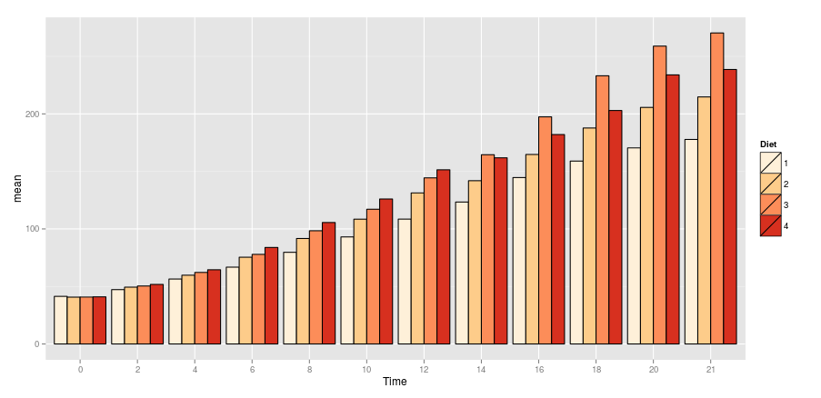

---
title       : An Intro to dplyr
subtitle    : performance coding with R
author      : Colin Pistell
job         : MS Business Analytics 2016
framework   : io2012        # {io2012, html5slides, shower, dzslides, ...}
highlighter : highlight.js  # {highlight.js, prettify, highlight}
hitheme     : solarized_dark      # 
widgets     : [quiz, bootstrap]            # {mathjax, quiz, bootstrap}
mode        : selfcontained # {standalone, draft}
knit        : slidify::knit2slides
---&vc2 bg:url(./assets/img/sloth.gif);background-size:cover
<style>
.title-slide {background:url(./assets/img/lightning.jpg);background-size: cover}
.title-slide hgroup > h1, 
.title-slide hgroup > h2 {
  color: white
}
</style>

<h1 class="emph wtxt txtcent">Your code using base R</h1>

---&vc2 bg:url(./assets/img/cheetah.gif);background-size:cover


<h1 class="emph wtxt txtcent">Your code using dplyr</h1>

---.paper

## Libraries You'll Need Loaded


```r
library(ggplot2)
library(dplyr)
library(tidyr)
library(knitr)
```


---.paper &radio

## Question Example

Interactive questions! Select your answer and hit submit to see if you're right. Hints are available as is an explanation if you get stuck. Let's try!

What's the best part of Jurassic Park?

1. The T-Rex
2. The Velociraptors
3. _Sexy Jeff Goldblum_

*** .hint

<br>
mmmm.... Chaos Theory...

*** .explanation


---.paper

## The Basics

dplyr (and tidyr) comprise a set of functions and tools to clean, reshape, subset, and aggregate data.

- They make working with data very easy
- They're also very very fast
- Seriously, <b>very very fast</b>

---.paper

## The Philosophy

- dplyr and tidyr both have just a few functions
- Each function does just one thing, but does it very well
- The functions all have a constrained set of options/arguments
- This makes the functions easy to use, but very flexible and powerful when combined
- Under the hood, dplyr runs in highly optimized C code.
- You can read more [here](https://cran.rstudio.com/web/packages/dplyr/vignettes/introduction.html)

---.paper

## What We'll be Covering

- Subsetting with select() and filter()
- Adding rows with mutate()
- A bit of reshaping with arrange()
- Grouping and aggregating with group_by() and summarise()
- Piping (!!!)

## What we sadly won't get to

- dplyr's built in database connectivity (unfortunately not so good with MySQL)
- Window functions
- Joins and data set combination.

---.paper

## select() and filter()

- select(dataframe, column1, column2...) selects columns from a dataframe
- filter(dataframe, logic test) selects rows from a dataframe based on the logical test
- select() works just like SELECT in SQL, filter() works just like WHERE

An example:


```r
data(mtcars)
mtcarsSelect <- select(mtcars, mpg, cyl, hp, wt)
mtcarsFilter <- filter(mtcarsSelect, mpg >= 20)
```

---.paper &radio

## Practice

Load the iris data set. Using select() and filter(), create a new dataframe of Sepal Length and Sepal Width for only observations with a Sepal Length greater than 6.5. What is the sum of values in this new dataframe? (sum(dataframe) will work for the last step)

1. 1026.3
2. _304_
3. 642
4. 3121

*** .hint

<br>
Use select() first, then use filter() on the saved result from select. 

*** .explanation


```r
data(iris)
iris2 <- select(iris, Sepal.Length, Sepal.Width)
iris3 <- filter(iris2, Sepal.Length > 6.5)
kable(iris3)
```


| Sepal.Length| Sepal.Width|
|------------:|-----------:|
|          7.0|         3.2|
|          6.9|         3.1|
|          6.6|         2.9|
|          6.7|         3.1|
|          6.6|         3.0|
|          6.8|         2.8|
|          6.7|         3.0|
|          6.7|         3.1|
|          7.1|         3.0|
|          7.6|         3.0|
|          7.3|         2.9|
|          6.7|         2.5|
|          7.2|         3.6|
|          6.8|         3.0|
|          7.7|         3.8|
|          7.7|         2.6|
|          6.9|         3.2|
|          7.7|         2.8|
|          6.7|         3.3|
|          7.2|         3.2|
|          7.2|         3.0|
|          7.4|         2.8|
|          7.9|         3.8|
|          7.7|         3.0|
|          6.9|         3.1|
|          6.7|         3.1|
|          6.9|         3.1|
|          6.8|         3.2|
|          6.7|         3.3|
|          6.7|         3.0|

```r
sum(iris3)
```

```
## [1] 304
```

---&vc2 bg:url(./assets/img/pipe2.gif);background-size:cover

<h1 class="emph wtxt txtcent">The Magic of Pipes</h1>

---.paper

## Introducing Piping (%>%)

dplyr's piping function is worth the install all by itself. After using it for a while you'll start to wonder why it's not a part of Base R.

- Essentially, piping allows you to feed the output of one function into another function
- This allows us to avoid messy/confusing nesting of code. Let's look at a silly example:

If we wanted to bake a cake, we would want to follow these steps:

    - Mix together the ingredients (eggs, butter, sugar, milk, flour)
    - Bake for 30 minutes at 300 degrees
    - Cool for 20 minutes
    - Cover in chocolate frosting

---.paper

## Piping Example continued...

In pseudo code, our cake making code would look something like this:

    frost(cool(bake(mix(eggs,butter,sugar,milk,flour),min=30,deg=300),min=20),chocolate)

Gross. Now let's try with pipes:

    (eggs, butter, sugar, milk, flour) %>% mix() %>% bake(min=30, deg=300) %>%
    cool(min=20) %>% frost(chocolate)

Much clearer. Let's look at our mtcars example with piping:


```r
mtcarsFilter <- mtcars %>% select(mpg, cyl, hp, wt) %>% filter(mpg >= 20)
```

---.paper &radio

## Practice

Using the iris dataset, select sepal length, sepal width, and petal length, filter for sepal lengths greater than 4 but less than 5 and then find the sum of the matrix. Use piping.

1. 183.2
2. 414
3. 229.6
4. _207_

*** .hint

<br>
You want to flow from select to filter to sum. filter is going to include an '&' operator

*** .explanation


```r
iris %>% select(Sepal.Length, 
                Sepal.Width, 
                Petal.Length) %>% 
    filter(Sepal.Length > 4 
           & Sepal.Length < 5) %>% 
    sum()
```

```
## [1] 207
```

---.paper

## Easy Ordering With arrange()

We've all experienced how ordering a vector or dataframe in R is surprisingly convoluted. Dplyr makes it much easier:

- arrange(dataframe, column1, column2, etc) arranges a dataframe in ascending order by column 1. Any ties are decided by column 2, etc.
- If you want descending order instead, simply use the desc() function on each column.
- Works great with piping!

---.paper

## An arrange() Example:


```r
irisOrdered <- iris %>% select(Sepal.Length, Sepal.Width) %>% 
    filter(Sepal.Length < 5) %>% 
    arrange(desc(Sepal.Length), desc(Sepal.Width))
kable(head(irisOrdered))
```


| Sepal.Length| Sepal.Width|
|------------:|-----------:|
|          4.9|         3.6|
|          4.9|         3.1|
|          4.9|         3.1|
|          4.9|         3.0|
|          4.9|         2.5|
|          4.9|         2.4|

---.paper &radio

## Practice

Using mtcars, create an ordered table of mpg, weight (wt), and horsepower (hp) for all cars with an mpg > 20. Order the list by descending mpg followed by ascending wt, followed by ascending hp. What is the weight of the top entry for the first mpg tie in the table?

1. _1.513_
2. 2.875
3. 1.615
4. 2.620

*** .hint
<br>
Remember to use desc() where appropriate. Don't forget about piping!

*** .explanation


```r
kable(mtcars %>% select(mpg, wt, hp) %>% 
          filter(mpg > 20) %>% 
          arrange(desc(mpg), wt, hp))
```


|  mpg|    wt|  hp|
|----:|-----:|---:|
| 33.9| 1.835|  65|
| 32.4| 2.200|  66|
| 30.4| 1.513| 113|
| 30.4| 1.615|  52|
| 27.3| 1.935|  66|
| 26.0| 2.140|  91|
| 24.4| 3.190|  62|
| 22.8| 2.320|  93|
| 22.8| 3.150|  95|
| 21.5| 2.465|  97|
| 21.4| 2.780| 109|
| 21.4| 3.215| 110|
| 21.0| 2.620| 110|
| 21.0| 2.875| 110|

---.paper

## Adding New Information With mutate()

Let's say you want to create a new column that somehow combines information in two or more columns in that row. We can use apply or a for loop to do this... or just use mutate(). An example will make things clear:


```r
data(diamonds)
kable(head(diamonds, 6))
```


| carat|cut       |color |clarity | depth| table| price|    x|    y|    z|
|-----:|:---------|:-----|:-------|-----:|-----:|-----:|----:|----:|----:|
|  0.23|Ideal     |E     |SI2     |  61.5|    55|   326| 3.95| 3.98| 2.43|
|  0.21|Premium   |E     |SI1     |  59.8|    61|   326| 3.89| 3.84| 2.31|
|  0.23|Good      |E     |VS1     |  56.9|    65|   327| 4.05| 4.07| 2.31|
|  0.29|Premium   |I     |VS2     |  62.4|    58|   334| 4.20| 4.23| 2.63|
|  0.31|Good      |J     |SI2     |  63.3|    58|   335| 4.34| 4.35| 2.75|
|  0.24|Very Good |J     |VVS2    |  62.8|    57|   336| 3.94| 3.96| 2.48|

---.paper

## mutate() Example continued...

Let's say we want to add a volume measure to each entry. Using mutate() makes it easy:


```r
diamonds <- mutate(diamonds, volume = x * y * z)
kable(head(diamonds, 6))
```


| carat|cut       |color |clarity | depth| table| price|    x|    y|    z|   volume|
|-----:|:---------|:-----|:-------|-----:|-----:|-----:|----:|----:|----:|--------:|
|  0.23|Ideal     |E     |SI2     |  61.5|    55|   326| 3.95| 3.98| 2.43| 38.20203|
|  0.21|Premium   |E     |SI1     |  59.8|    61|   326| 3.89| 3.84| 2.31| 34.50586|
|  0.23|Good      |E     |VS1     |  56.9|    65|   327| 4.05| 4.07| 2.31| 38.07688|
|  0.29|Premium   |I     |VS2     |  62.4|    58|   334| 4.20| 4.23| 2.63| 46.72458|
|  0.31|Good      |J     |SI2     |  63.3|    58|   335| 4.34| 4.35| 2.75| 51.91725|
|  0.24|Very Good |J     |VVS2    |  62.8|    57|   336| 3.94| 3.96| 2.48| 38.69395|

---.paper &radio

## Practice

First, run this bit of code to add a car name column to mtcars:


```r
mtcars$cars <- rownames(mtcars)
```

Let's define efficiency as mpg/horsepower. Create a table showing in descending order the most efficient cars. What's the most efficient car?

1. Toyota Corolla
2. Maserati Bora
3. _Honda Civic_
4. Valiant

*** .hint
<br>
select() %>% mutate %>% arrange()

*** .explanation


```r
mtcars %>% select(cars, mpg, hp) %>% 
    mutate(efficiency = mpg/hp) %>% 
    arrange(desc(efficiency)) %>% 
    head(5) %>% kable()
```


|cars           |  mpg| hp| efficiency|
|:--------------|----:|--:|----------:|
|Honda Civic    | 30.4| 52|  0.5846154|
|Toyota Corolla | 33.9| 65|  0.5215385|
|Fiat 128       | 32.4| 66|  0.4909091|
|Fiat X1-9      | 27.3| 66|  0.4136364|
|Merc 240D      | 24.4| 62|  0.3935484|

---.paper

## Grouping and Aggregating 

Let's get to the good stuff. Dplyr really starts to shine when we use it for aggregation. The syntax is easier, it's more flexible, and it's a whole lot faster than aggregate. The only downside is we have to use two steps:

- The first step is to use the group_by() function:


```r
data(iris)
irisGroup <- group_by(iris, Species)
```

One very important note is you can group by more than one variable. Here it only makes sense to use species.

---.paper

## group_by continued...


```r
head(irisGroup)
```

```
## Source: local data frame [6 x 5]
## Groups: Species [1]
## 
##   Sepal.Length Sepal.Width Petal.Length Petal.Width Species
##          (dbl)       (dbl)        (dbl)       (dbl)  (fctr)
## 1          5.1         3.5          1.4         0.2  setosa
## 2          4.9         3.0          1.4         0.2  setosa
## 3          4.7         3.2          1.3         0.2  setosa
## 4          4.6         3.1          1.5         0.2  setosa
## 5          5.0         3.6          1.4         0.2  setosa
## 6          5.4         3.9          1.7         0.4  setosa
```

Notice that our output has changed a little. Dplyr has wrapped our dataframe with some useful information, including our Group values. It also lets us know what kind of variables are in each column. Helpful!

---.paper

## Using summarise() to Aggregate

Now we're ready to aggregate. in dplyr this is done with the summarise() function. The syntax is pretty straightforward and always follows this pattern:

summarise(<groupedDataFrame>, <name of variable> = <FUN()>, etc. )

For example:


```r
irisSummary <- summarise(irisGroup, meanSepalLength = mean(Sepal.Length))
kable(irisSummary)
```


|Species    | meanSepalLength|
|:----------|---------------:|
|setosa     |           5.006|
|versicolor |           5.936|
|virginica  |           6.588|

Just like we can group by more than one variable we can also ask for multiple aggregation functions in each summary. 

---.paper

## One Weird Thing

group_by() and summarise() are extremely easy to use, but there's one thing to watch out for. If you want to summarize by count you can't use length() like you do with the base aggregate function. You need to use n() with no arguments. Let's look at an example:


```r
#We can use the same grouped dataframe
irisCount <- summarise(irisGroup, Mean = mean(Sepal.Length), Count = n())
kable(irisCount)
```


|Species    |  Mean| Count|
|:----------|-----:|-----:|
|setosa     | 5.006|    50|
|versicolor | 5.936|    50|
|virginica  | 6.588|    50|

---.paper &radio

## Practice

Let's do some aggregation on the diamonds dataset. Provide a count and the mean price of the diamonds, broken down by cut and color. What is the count and mean price of Ideal cut diamonds with a color of F?

1. 2331, 4324.89
2. 522, 5078.53
3. 2834, 2629.10
4. _3826, 3374.94_

*** .hint
<br>
Remember to use multiple group_bys and multiple summarises

*** .explanation


```r
diamonds %>% group_by(cut, color) %>% 
    summarise(Count = n(), 
              meanPrice = mean(price)) %>% 
    filter(cut == "Ideal") %>% kable()
```


|cut   |color | Count| meanPrice|
|:-----|:-----|-----:|---------:|
|Ideal |D     |  2834|  2629.095|
|Ideal |E     |  3903|  2597.550|
|Ideal |F     |  3826|  3374.939|
|Ideal |G     |  4884|  3720.706|
|Ideal |H     |  3115|  3889.335|
|Ideal |I     |  2093|  4451.970|
|Ideal |J     |   896|  4918.186|

---.paper

## Prepping for the Final Challenge: ggplot

Before I toss you into your final challenge, let's quickly review how to move past qplot() and use the full ggplot() function:

- You typically use ggplot in 2 steps: 
- First, you use ggplot(data, aesthetics) to define the broad strokes of the plot
- Then you add geoms() to create the visuals. 

---.paper

## ggplot continued...

Here's a quick example:


```r
mtcars$cyl <- factor(mtcars$cyl)
g <- ggplot(data = mtcars, aes(x = wt, y = mpg, fill = cyl))
g + geom_point(size = 4, shape = 21) + scale_fill_brewer(palette = "Set2")
```

 

---.paper

## geom_bar() Overview

- By default geom_bar() (what we use to make bar graphs and histograms) only needs an x aes mapping because it wants to create bins and histograms. We can change this with the following:


```r
g + geom_bar(stat = "identity")
```

This will make ggplot tie your x and y aes mappings together. If you map a fill color ggplot will create a stacked bar graph. You can turn this into a paired graph with the following option:


```r
g + geom_bar(position = "dodge")
```

---.paper

## A Brief Tirade on Colors

Every time you use the default color scheme in R a puppy dies somewhere in the world. For the sake of all things cute and fuzzy, use different colors.
- An easy approach is to install the RColorBrewer package and use the related ggplot functions:


```r
install.packages("RColorBrewer")
```

A nice guide to the available RColorBrewer palettes can be found [here](https://www.nceas.ucsb.edu/~frazier/RSpatialGuides/colorPaletteCheatsheet.pdf)

Your go-to functions in ggplot will be:


```r
scale_color_brewer()
scale_fill_brewer()
```

---.paper &radio

## The Final Challenge

Let's put it all together. Load the ChickWeight dataset. You need to tell your boss which diet performs the best over time. Your boss is a visual person, so create a plot that tells the full story. Also, as a visual person, your boss is sensitive to color choice and will fire you if you use the default color scheme. After looking at your visualization, which diet is best?

1. 1
2. 2
3. _3_
4. 4

*** .hint
<br>
You'll need to aggregate the data by two variables

*** .explanation



---.paper

## Deeper into Dplyr

- We didn't cover every feature of dplyr. You should do some exploration on your own of some of its most powerful features
- Window functions are especially interesting and powerful. Think of them as aggregation functions that return many results rather than just one.
- [This](https://www.rstudio.com/wp-content/uploads/2015/02/data-wrangling-cheatsheet.pdf) is an incredibly useful cheat sheet.

---.paper

## If You Need More Speed

- Dplyr is fast, but it's not the fastest kid on the block. That title belongs to data.table
- data.table requires you to learn a different syntax. It's not that hard, but it's a bit of work
- It's scary fast. The only explanation for its speed is Black Magic. Be warned...


